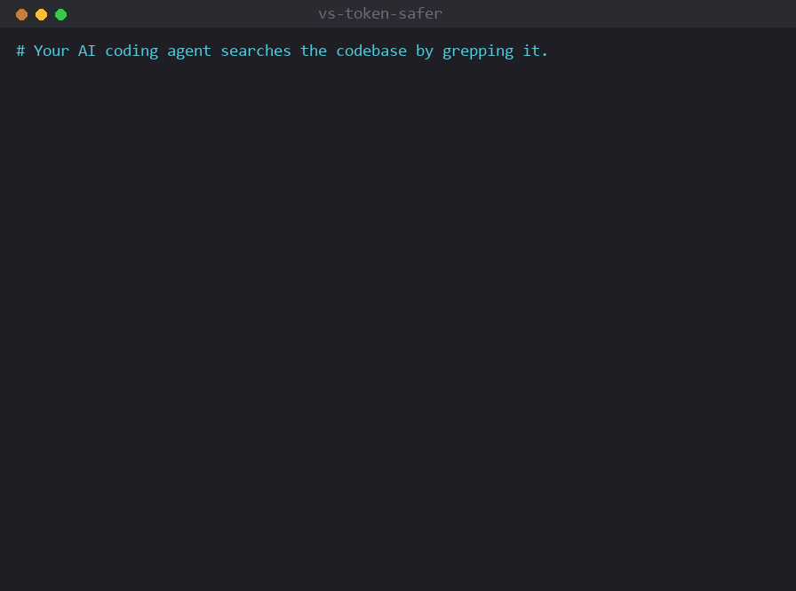

# vs-token-safer · gamedev-log-analyzer

[English](README.md) · **한국어**

[](https://code.claude.com/docs/en/plugins)
[](https://modelcontextprotocol.io)
[](https://glama.ai/mcp/servers/JSungMin/vs-token-safer)
[](https://github.com/JSungMin/vs-token-safer/releases)
[](LICENSE)
[](https://github.com/JSungMin/vs-token-safer/pulls)
[](https://github.com/JSungMin/vs-token-safer/stargazers)

> 코딩 에이전트의 컨텍스트 창은 작고 저장소는 큽니다. **vs-token-safer는 그 사이에 앉습니다.**
> 무엇이 어디 있는지, 무엇이 그걸 호출하는지, 이름을 모를 땐 "auth 흐름이 어떻게 되나"까지 물어보면,
> 소스를 채팅에 쏟아붓는 대신 짧은 `file:line` 목록을 돌려줍니다. 될 땐 정확하게 — 진짜 언어 서버
> (clangd / Roslyn / tsserver / pyright)로 — 안 될 땐 그래도 쓸모 있게(설치 없는 tree-sitter, 또는 저장소
> 자체의 작명으로 만든 fuzzy 검색, 임베딩 없음). Markdown·설정 파일도 같은 방식으로, 헤딩 이름만으로
> 섹션을 읽거나 고칩니다. 수십 MB 에디터 로그를 대화에 붙여넣지 않고 읽어 주는 형제 플러그인도 함께 옵니다.
> **모든 것은 당신 기기 안에 머뭅니다.**

<p align="center">
  
</p>

```text
# Claude가 코드를 grep하려 하면 → 훅이 그 자리에서 인덱스 질의로 바꿔치기:
$ grep -rn "SpawnActor" Source/**/*.cpp
↻ [vs-token-safer] 우회 → search_symbol "SpawnActor"          # 텍스트 매치가 아니라 시맨틱
  func SpawnActor (in AGameMode)   @ Source/GameMode.cpp:142   (+2 more)
  → ~120 토큰   (grep이었다면 수천 줄을 쏟아냈을 것)

# 그 심볼을 고친다면? 파일을 통째로 읽지도, 줄 번호를 세지도 않고 이름만 지정:
$ replace_symbol_body symbol="SpawnActor" body="…"           # 기본 미리보기, apply=true면 기록
  replace_symbol_body "SpawnActor" — PREVIEW at Source/GameMode.cpp:142-160
```
<sub>공개된 Unreal Engine 심볼로 만든 예시 출력. `VTS_REWRITE=0`이면 바꿔치기 대신 차단합니다.</sub>

## 왜 쓰나

- 큰 Unreal C++ / .NET 레포에서 `grep`은 컨텍스트를 잠식합니다. clangd/Roslyn 인덱스는 토큰 상한이 걸려 약 97~99% 작습니다 ([벤치마크](#성능)).
- Claude는 자꾸 `grep`으로 손이 갑니다. 훅은 단순히 막지 않고 **그 자리에서 명령을 인덱스 질의로 다시 씁니다.** 검색은 그대로 실행되고 흐름이 끊기지 않습니다.
- **줄이 아니라 심볼 단위로 편집합니다.** 선언을 *이름으로* 지정해 교체/앞뒤 삽입/삭제 — 인덱스가 범위를 알려 주므로 파일을 통째로 컨텍스트에 읽어 들일 필요가 없습니다.
- grep이 얼마나 새 나가는지 알기 어렵습니다. `vts discover`가 최근 세션을 읽어 어떤 검색이 인덱스를 우회했고 토큰을 얼마나 썼는지 짚어 줍니다.
- 언어 서버는 **헤드리스**로 돕니다 — IDE 프록시 방식과 달리 에디터를 띄울 필요가 없습니다.

## 빠른 시작

```bash
# 1) 설치 (형제 플러그인 gamedev-log-analyzer도 함께 설치됨)
/plugin marketplace add JSungMin/vs-token-safer
/plugin install vs-token-safer@vs-token-safer
/reload-plugins        # 첫 실행 때 서버 의존성 자동 설치 (수동 npm 불필요)

# 2) 설정 — 백엔드를 감지하고 프로젝트 경로를 물어 본 뒤 설정을 기록
/vs-token-safer:setup
```

그다음 **Claude Code 세션을 재시작**하세요 (`vs-search` MCP 서버는 새 세션에서만 뜹니다). 도구가 보이는지,
`grep src/**/*.cpp`가 인덱스로 우회되는지 확인하면 됩니다. 사전 준비물: **Node ≥ 18**과 언어 서버 —
clangd(C/C++) / Roslyn(C#)은 직접 설치, JS/TS·Python은 자동 설치됩니다. 자세한 건 아래
[사전 준비](#사전-준비-자세히)에 있습니다.

> 로그 분석기만 필요하면: `/plugin install gamedev-log-analyzer@vs-token-safer`.

## 도구

검색과 편집은 모두 공식 언어 서버 인덱스 — **clangd**(C/C++), **Roslyn**(C#/.NET), **tsserver**(JS/TS),
**pyright**(Python) — 를 거쳐, 소스 본문 없이 토큰 상한이 걸린 `file:line` 목록으로 돌아옵니다. MCP 서버
이름은 `vs-search`이고, `vts` CLI도 같은 도구를 씁니다.

**검색 / 탐색**

| 도구 | CLI | 하는 일 |
| --- | --- | --- |
| `search_symbol` | `vts symbol` | 이름/부분 문자열로 심볼 선언 찾기 (텍스트 아닌 시맨틱). |
| `find_references` | `vts references` | 심볼의 모든 호출 지점. **이름을 바로** 받습니다(`symbol="FooBar"`) — 함수/타입을 바꿔 모든 사용처를 손봐야 할 때 쓰는 도구. `detail=file`/`dir`이면 줄별 목록 대신 **blast-radius 요약**(의존처를 묶고 참조수로 랭킹). `direction=callers`/`callees`면 **멀티홉 콜 하이어라키**로 전환(이걸 *전이적으로* 호출하는 함수 = blast radius / 이게 호출하는 것)해 `depth` 홉까지 — LSP `callHierarchy` 기반이라 텍스트 스캔이 아닌 시맨틱 콜 그래프. `vts trace-calls`는 `references --direction callers` 단축. |
| `read_symbol` | `vts read-symbol` | **이름 지정한 선언 하나의 소스**만 반환 — 파일 통째 아님. `replace_symbol_body`의 읽기판: 700줄 파일을 Read하지 않고 함수 하나만 본다. `signatureOnly`로 헤드만. |
| `goto_definition` | `vts definition` | 위치의 정의로 이동. `kind=`로 `type_definition` / `implementation`(인터페이스·virtual의 구현체) / `declaration`도. |
| `hover` | `vts hover` | 위치의 타입/시그니처. |
| `document_symbols` | `vts symbols` | 파일 아웃라인 (클래스/함수/타입을 `file:line`으로). `scope=directory`면 dir 아래 모든 코드 파일의 **시그니처-only repo 스켈레톤**(파일마다 Read 없이 모듈 형태 파악). |
| `diagnostics` | `vts diagnostics` | 컴파일러/린터 에러·경고를 토큰캡 `file:line:col severity: message` 목록으로 — 원시 빌드 출력 읽기의 대체. 기본은 파일 1개, `scope=directory`면 프로젝트 전체 스캔. |
| `find_files` | `vts files` | 이름/glob으로 파일 찾기 — `find -name`의 토큰캡 대체. |
| `search_text` | `vts text` | 원시 텍스트/정규식 검색 — `grep`의 토큰캡 대체 (`path=`/`glob=`/`docs=true`로 범위 지정). |
| `concept_search` | `vts concept` | **퍼지** 검색 — 이름을 모르는 개념(`"auth login flow"`)을, repo 자체의 식별자+주석 공기로 만든 사전(임베딩 없음·무전송)으로 선언을 랭크. `--flow`면 최상위 결과를 콜그래프로 확장. |

**편집 (심볼 단위 — 줄을 세지 말고 이름을 대세요)** — 기본 미리보기, `apply=true`면 기록.

| 도구 | CLI | 하는 일 |
| --- | --- | --- |
| `rename` | `vts rename` | 시맨틱 프로젝트 전역 이름 변경 (텍스트 sed가 아니라 모든 참조). |
| `replace_symbol_body` | `vts replace-symbol` | 선언 전체(시그니처+본문)를 이름으로 교체 — 범위는 인덱스가 알려 줍니다. |
| `insert_symbol` | `vts insert` | 선언 옆에 텍스트 삽입 — `position=after`(기본, 예: 형제 메서드) 또는 `before`(예: import/속성). |
| `safe_delete` | `vts safe-delete` | 선언 삭제 — **참조가 남아 있으면 거부**, `force=true`라야 진행. |

> **문서·설정 파일도 (구조 티어).** `document_symbols` / `read_symbol` / `replace_symbol_body` / `insert_symbol` / `safe_delete`를 **Markdown / AsciiDoc / reST / TOML / INI / YAML / JSON / text** 파일에 겨누면 "심볼" = **섹션**(헤딩·`[section]`·키): 2000줄 `CLAUDE.md`를 ~30줄 아웃라인으로, `## 섹션` 하나를 통째 Read 없이 이름으로 읽기·교체. 언어 서버 불필요, 새 도구 0 — 코드에 쓰던 token-safer 동작을 문서에 그대로.

**관리 / 메타 — MCP 도구 하나 `vts_admin {op, params}`** (세션당 도구 정의 비용을 줄이려 한데 묶음;
CLI는 개별 서브커맨드 유지):

| `op` | CLI | 하는 일 |
| --- | --- | --- |
| `git` / `p4` | `vts git` / `vts p4` | 읽기 전용 `git status/log/diff` 또는 Perforce `opened/status/changes/reconcile`를 돌려 그룹/중복제거/상한. 변경 서브커맨드는 거부. |
| `setup` / `config` | `vts setup` / `vts config` | 설정/확인 (projectPath, backend, maxResults, clangdCmd, genCompileDb). |
| `savings` / `savings_reset` | `vts savings` | 토큰 절약 원장 (graph/daily/history) / 초기화. |
| `warmup` | `vts warmup` | 언어 서버 인덱스 미리 빌드. |
| `discover` | `vts discover` | vts를 우회한 코드 검색 찾기 (놓친 절약분). |
| `gen_compile_db` | `vts gen-compile-db` | Unreal clangd 컴파일 DB 생성 (UBT). |

예: `vts_admin {op:"git", params:{argv:["status","-s"]}}`. 아니면 "X 어디 있어 / Y 누가 부르나 / 파일 W
찾아" 류 조회를 통째로 **`code-locator` 서브에이전트**에 넘겨도 됩니다 — 자기 컨텍스트에서 검색하고
`file:line` 표만 돌려줍니다.

**대시보드 — `vts serve`.** vts가 아는 것 + 얼마나 아꼈는지를 로컬에서 인터랙티브하게: 절감 추이,
언어 믹스, 도구별 절감, 그리고 **인터랙티브 3D 그래프**(WebGL / Three.js) — 두 모드: **include 그래프**
(파일을 include 팬인으로 크기) + **온디맨드 콜그래프**(심볼 입력 → 그 함수의 전이적 caller/callee를 LSP
`callHierarchy`로 라이브 추적, 영속 인덱스 없음; 노드/엣지별 **호출 횟수** 표시). 노드는 **구 셸**에 배치되어
뭉치지 않고 퍼집니다. 드래그/`WASD`로 회전, 휠/`+`-`-`로 줌, `R`로 맞춤, 호버로 `file:line`. 심볼 검색은
**라이브 자동완성**(`/symbols`); **색상 기준**: 연결요소 **groups** · **repo**(각 노드가 어느 레포 소속인지, 범례
포함) · **heat**; **노드 클릭 시 그 그룹으로 drill-in**(`Esc`/`Backspace`로 빠져나옴); **포커스/최대화** 토글,
하이라이트 필터, 노드/엣지 메트릭 오버레이.

가장 쉬운 건 슬래시 커맨드: **`/vs-token-safer:viz`**(열기) · **`/vs-token-safer:viz-stop`**(닫기). 또는 CLI:

```bash
vts serve --open     # → http://127.0.0.1:8731/  (브라우저 자동 실행; --port N으로 변경)
vts serve --stop     # 중지 (또는 프로세스 Ctrl-C)
```

**127.0.0.1 전용이고 완전 자가완결 페이지** — CSS/JS 인라인 + **Three.js를 로컬 번들**(`server/vendor/`,
same-origin 서빙, CDN 아님)이라 아무것도 머신을 떠나지 않고 네트워크 없이도 렌더됩니다. vts의 나머지와 동일한
신뢰 모델. Node 표준 `http`만 사용(웹 프레임워크 의존성 0)하고 **직접 실행할 때만** 뜹니다 — MCP 서버는 절대
띄우지 않아 상시 패키지는 얇은 stdio 클라이언트로 유지됩니다. 3D 그래프는 `VTS_VIZ_MAX_NODES`(200)로 캡됩니다.

```
$ vts symbol --q SpawnActor --projectPath ./MyGame
3 symbol(s) matching "SpawnActor" (backend: clangd, root: ./MyGame):
func SpawnActor (in AGameMode)  @ MyGame/Source/GameMode.cpp:142
method SpawnActorDeferred (in UWorld)  @ MyGame/Source/World.cpp:88
func SpawnActorFromClass  @ MyGame/Source/SpawnLib.cpp:31

✓ Saved ~4,200 tokens here (96.8% / 31× smaller than the raw index response).
```

## 동작 방식

clangd와 Roslyn이 시맨틱 분석은 이미 해 줍니다. 이 플러그인이 그 위에 얹는 건 **강제, 토큰 상한, 헤드리스
스폰 + 워밍업** — Claude가 grep 대신 실제로 인덱스를 쓰게 만드는 부분입니다.

| 계층 | 효과 |
| --- | --- |
| **바꿔치기/강제 훅** | 네 표면을 다룹니다. **Bash** grep/rg/`find -name`이 소스를 향하면 → 그 자리에서 같은 뜻의 `vts` 질의로 **바꿔치기**(식별자 → `search_symbol`, 리터럴 → `search_text`, `find <dir> -name` → `<dir>`를 루트로 한 `find_files`); 애매하면(파이프라인, 다중 `-name`) 차단. **Grep 도구**의 명백한 심볼 사냥(맨 식별자, `::`/`(`/`void·class` 정규식, `FooBar\|BazQux` 식 CamelCase 교대)은 바로 쓸 수 있는 호출과 함께 **차단**, 자유 텍스트·키워드 교대는 경고만. **Glob 도구**의 구체적 코드 파일(`*.cpp`, `Foo.h`)은 `find_files`로 **차단**. **Edit/MultiEdit**가 **선언 통째**를 교체/추가하면 → 심볼편집 도구(`replace_symbol_body`/`insert_symbol`)로 유도하는 모델 가시 넛지, 반복 무시 시 안전한 insert는 차단으로 격상(`VTS_EDIT_WARN`, `VTS_EDIT_BLOCK_AFTER`); 선언 일부 수정은 조용. 메시지는 에이전트 대상이고 EN/KO 양쪽. 로그·`.md`·설정은 통과. 스위치: `VTS_REWRITE=0`, `VTS_GREP_BLOCK=0`, `VTS_ENFORCE=0`. |
| **토큰캡 코어** | LSP 결과를 `kind name @ file:line`으로 바꾸고 상한을 건 뒤 `… N more`를 붙입니다. 참조가 많은 결과는 파일당 한 줄로(`Foo.cpp:42,88,120`) 접고 공통 디렉터리 접두사를 한 번만 빼냅니다(`VTS_COMPACT_RESULTS=0`이면 줄당 복원). 잘린 `find_files`/`search_text`는 전체를 복구 파일로 tee. |
| **심볼 단위 편집** | `replace_symbol_body`/`insert_*`/`safe_delete`가 아웃라인으로 선언을 이름으로 찾아 정확한 범위에 텍스트를 끼웁니다 — 기본 미리보기, `apply=true`면 기록, `safe_delete`는 참조가 남으면 거부. 파일을 통째로 컨텍스트에 읽지 않습니다. |
| **헤드리스 LSP 클라이언트** | 직접 만든 LSP 클라이언트가 공식 엔진을 stdio로 띄웁니다. 프로젝트 루트는 **호출마다** 결정됩니다(명시 `projectPath` → 질의한 파일의 소속 프로젝트 → MCP 워크스페이스 루트). 그래서 전역 서버 하나가 **세션이 건드리는 모든 레포**에 답합니다. 살아 있는 백엔드는 풀로 묶여 상한이 걸립니다(`VTS_MAX_BACKENDS` + 유휴 수거기). |
| **절감 + discover** | 로컬 장부가 검색마다 아낀 토큰을 기록합니다(`vts savings`, 30일 그래프 포함). `vts discover`는 최근 세션에서 인덱스를 **우회한** 검색을 훑어 — 단순 합계가 아니라 포착률을 보여 줍니다. |

> **엔진은 공식, 글루는 우리 것.** clangd(LLVM)와 Roslyn(Microsoft)이 분석을 하고, 이 레포는 LSP↔MCP
> 글루만 씁니다. 제3자 MCP 서버가 소스 위에서 돌지 않습니다. 로컬 전용, 아무것도 업로드하지 않습니다.

## 두 플러그인

| 플러그인 | 하는 일 | 필요한 것 |
| --- | --- | --- |
| **vs-token-safer** (이 페이지) | 코드 검색·편집을 Bash grep 대신 clangd/Roslyn/tsserver/pyright 인덱스로 강제, `file:line`으로 토큰캡 | Node + 언어 서버 (clangd / Roslyn은 직접, JS/TS·Python은 자동). IDE 불필요. |
| **[gamedev-log-analyzer](gamedev-log-analyzer/README.md)** | 거대한 Unreal/Unity/Godot/MSVC-UBT 로그를 파싱/중복제거/분류, 검색 + diff + 스칼라 추출 | Node만 |

`vs-token-safer`가 `gamedev-log-analyzer`를 의존성으로 선언하므로 한 번 설치로 둘 다 들어옵니다. **함께
쓰기:** 로그 분석기가 항목마다 `file:line`을 내놓으면 → 그걸 `goto_definition`/`find_references`에 넘겨
grep이나 원시 로그 덤프 없이 코드를 엽니다. 반대 방향도 됩니다 — 로그(`Logs/`, `.log`/`.jsonl`)를 향한 코드
검색은 빈 결과 대신 gamedev-log를 가리켜 줍니다.

| 합산 절감 (실측) | Bash / 원시 | 플러그인 | 절감 |
| --- | ---: | ---: | ---: |
| 실제 UE5 레포 심볼 검색 (`FGameplayTag`) | ~282,194 토큰 | ~2,048 토큰 | **~99.3% (~138×)** |
| 원시 인덱스 응답 → 캡 목록 (eval, 심볼 1,000개) | ~57,308 토큰 | ~1,549 토큰 | **~97.3%** |
| ~1 MB 에디터 로그 읽기 (`summary`) | ~267,000 토큰 | ~130 토큰 | **~99.95%** |

## 성능

대형 Unreal Engine 5 프로젝트에서의 실제 A/B: 공개 엔진 심볼 하나(`FGameplayTag`)를 Bash grep-and-paste로
찾을 때와 이 플러그인으로 찾을 때. 프로젝트 소스는 재현하지 않고 집계 수치만 씁니다.
[BENCHMARK.md](BENCHMARK.md) 참고.

| | Bash grep-and-paste (레포 전체) | **플러그인 (clangd 인덱스, 캡)** |
| --- | ---: | ---: |
| 모델이 받는 것 | 5,654줄 / 1,010파일 | 시맨틱 선언 47개 (`file:line`) |
| 모델로 가는 토큰 | ~282,194 | **~2,048** |

**약 99.3% 적음(~138×).** grep은 매칭된 줄의 전체 텍스트를 돌려주고 텍스트로 매칭하니(주석·문자열·무관한
식별자) 더 많이 잡습니다. 플러그인은 시맨틱 히트마다 `file:line` 하나씩, 상한을 걸어 돌려줍니다. mock-LSP
eval(`node eval/run.mjs`, 툴체인 불필요)이 커밋마다 이걸 검증합니다: `~57,308 → ~1,549 토큰` = **97.3%**
(검사 53/53).

<details>
<summary><b>정확도: 정밀도/재현율 트레이드오프</b></summary>

- **재현율:** 플러그인은 모든 텍스트 출현이 아니라 상위 `N`개(캡)를 돌려줍니다 — 빠진 꼬리는 대개 주석/include/부분 문자열 잡음입니다. 전수가 필요하면 `maxResults`를 올리거나 grep을 쓰세요.
- **정밀도:** grep은 모든 부분 문자열을 매칭하지만(`Foo` 질의가 `FooBar`도 잡음), 인덱스는 서로 다른 시맨틱 선언을 돌려줍니다.

그래서 탐색(정의 하나 + 대표 사용처)에는 플러그인이 더 정확하면서 훨씬 쌉니다. 전수 출현 감사라면 캡을
올리거나 일부러 grep으로 떨어뜨리세요.
</details>

<details>
<summary><b>프리워밍 &amp; 적중률</b></summary>

clangd는 비동기로 인덱싱하므로 *첫* 검색은 일회성 워밍업을 치릅니다. vts는 이걸 IDE처럼 다룹니다: MCP
서버가 **부팅 때 프리워밍**하고(`VTS_PREWARM`, `projectPath`가 있으면 기본 켜짐) 클라이언트를 세션 동안
캐시하므로 비용은 한 번만 냅니다. `vts warmup`은 디스크 인덱스를 미리 빌드하고(CLI/CI),
`VTS_CLANGD_REMOTE`는 공유 프리빌드 인덱스 서버를 가리킵니다.

순서가 중요합니다. clangd는 연 파일의 우선순위를 올리므로, vts는 **쿼리 이력 우선**으로 워밍합니다 — 그다음
지금 편집 중인 것(`git status` / `p4 opened`), git-log 최신순, include 중심성, mtime 순. 거대한 트리에서는
일부만 워밍할 수 있으니, 이 순서가 워밍 창에 실제 검색할 것이 담기게 만듭니다. 실측 향상
(`node eval/bench-hitrate.mjs`, 2,000파일):

| 워밍업 캡 | 임의 순서 | 이력 순서 | 향상 |
| --- | --- | --- | --- |
| 파일의 3% | 1.5% | **54.3%** | **36×** |
| 5% | 7.8% | **56.5%** | 7.3× |
| 10% | 11.3% | **62.5%** | 5.6× |
| 20% | 24.8% | **68.5%** | 2.8× |
| 50% | 46.3% | **80.5%** | 1.7× |

워밍할 수 있는 조각이 작을수록 이득이 큽니다.
</details>

<details>
<summary><b>큰 트리: 스코프 &amp; 사전 인덱싱(콜드 스타트)</b></summary>

거대 모노레포(예: 전체 Unreal Engine 소스 트리, 번역 단위 ~26k)에서는 콜드 인덱스가 유일한 실비용입니다.
두 옵트인 지렛대로 줄입니다 — 둘 다 로컬, 전송 없음:

**1. 스코프 — 전체가 아니라 서브트리만 인덱싱.** 무엇을 스코프할지 보고 설정:

```bash
vts scope --projectPath /path/to/UE        # 현재 스코프, 유지/전체 TU 수, 고를 수 있는 최상위 디렉터리 표시
vts setup --scope "TSGame,Plugins"         # 영속화(또는 VTS_SCOPE="TSGame,Plugins"); 이후 reload/재시작
```

그러면 clangd가 스코프 내 번역 단위만 인덱싱하고(실측 UE5: `TSGame` → 26,488 중 3,377 TU, **13%**), 모든
백엔드의 워밍도 함께 스코프됩니다. 스코프 미설정 = 기존 전체 트리 동작 그대로.

**2. 사전 인덱싱 — 첫 질의 전에 인덱스를 빌드.**

```bash
vts preindex --projectPath /path/to/UE     # 위 스코프를 따름
```

**full LLVM 릴리스**가 설치돼 있으면(`clangd` 옆에 `clangd-indexer` 동봉) 단일 정적 인덱스를 오프라인으로
빌드하고 clangd가 `--index-file`(원격 서버가 아닌 로컬 파일)로 로드 — 게으른 백그라운드 크롤을 기다리지 않고
첫 질의가 즉시. `clangd-indexer`가 없으면 워밍 패스로 폴백(+ full LLVM 설치 안내). 바이너리는
`VTS_CLANGD_INDEXER_CMD`로 지정.

**3. 제로-셋업 티어 — 툴체인 없이, 어떤 repo에서나 즉시.** 컴파일 DB도, 언어 서버도, 대기도 없이?
vts는 그래도 **tree-sitter** 파싱으로 `search_symbol`에 답합니다(공식 표준 파서, 36개 언어, wasm 번들 —
네이티브 빌드 없음) — 사용처 grep이 아니라 진짜 *선언*을, 동일한 토큰캡 `file:line` 형태로. 커밋 가능한
인덱스를 만들면 즉시·공유 가능해집니다:

```bash
vts index --projectPath /path/to/repo      # .vts-index/symbols.jsonl 작성 (커밋하세요!)
vts index --status                          # 현재 커밋된 인덱스 표시
```

`.vts-index/symbols.jsonl`은 평문·git 커밋 가능·이식성 — 커밋해 두면 팀원(과 본인의 cold start)이 제로
셋업으로 즉시 심볼 검색을 얻습니다. 언어 서버가 인덱싱을 마치면 자동으로 이를 대체합니다(구문 티어는 선언
위치를, LSP는 그 위에 참조/오버로드/타입 해소를 더함). 벤치마크(150파일 심볼 검색): grep `4917` →
tree-sitter `53` 토큰 = **98.9%**, 툴체인 불필요.

**기존 사용자는 setup을 다시 해야 하나요?** 기본(전체 트리) 동작은 **아니요** — 플러그인 업데이트 후
`/reload-plugins`만 하면 됩니다. 스코핑을 *옵트인*하려는 경우에만 `vts setup --scope …`를 한 번 실행하면 되고,
`clangd-indexer` 경로는 vts setup이 전혀 필요 없습니다(자동 감지 — full LLVM만 설치돼 있으면 됨).
</details>

<details>
<summary><b>절감 &amp; discover (포착률)</b></summary>

검색마다 원시 인덱스 응답을 그대로 보내는 것 대비 아낀 토큰을 기록합니다. `/vs-token-safer:savings`,
`vts savings`(`--graph`/`--daily`/`--history`)로 확인하고, `vts savings-reset`으로 초기화합니다.

```
vs-token-safer savings (local, 1 search(es))
  total saved: ~4,200 tokens vs forwarding raw index responses
  raw → output: 4,340 → 140 tok (~31× smaller)
  est. value: ~$0.01 (@ $3/Mtok — set VTS_USD_PER_MTOK)
```

이건 *포착한* 쪽입니다. `vts discover`는 최근 세션에서 인덱스를 **우회한** 검색을 훑습니다:

```
$ vts discover --since 1
  86 code search(es) bypassed vts (Grep×48, Glob×18, grep×12, find×8)
  catch-rate: ~770,333 tok caught (via vts) vs ~28,692 still bypassing → 96.4% routed through vts
```

(훅이 *차단한* 검색은 우회로 세지 않습니다.) `discover`는 로컬·읽기 전용입니다 — 트랜스크립트 메타데이터와
도구 입출력 크기만 읽고 어디로도 보내지 않습니다. `--learn`은 과거 검색이 실제로 건드린 파일을 워밍업
세트에 먹여, 세션마다 인덱스를 더 따뜻하게 둡니다.
</details>

## 사전 준비 (자세히)

<details>
<summary><b>언어 서버 &amp; 컴파일 데이터베이스</b></summary>

- **Node.js ≥ 18**이 PATH에.
- **C/C++ → clangd ≥ 22** ([릴리스](https://github.com/clangd/clangd/releases)). Visual Studio에 번들된 clangd 19.1.x는 실제 Unreal TU를 서버 모드로 인덱싱할 때 **교착**합니다 — 오래된 게 감지되면 vts가 경고합니다. `compile_commands.json`이 필요합니다. **full LLVM 릴리스**를 권장 — `clangd` 옆에 `clangd-indexer`가 동봉되어 `vts preindex`가 즉시 정적 인덱스를 만듭니다(*큰 트리: 스코프 &amp; 사전 인덱싱* 참고).
- **C#/.NET → Roslyn LSP.** VS Code C# 확장(`ms-dotnettools.csharp`)을 설치하면 vts가 번들에서 `Microsoft.CodeAnalysis.LanguageServer`와 런타임을 자동 감지합니다. 대안: `dotnet tool install --global csharp-ls`. `.sln`/`.csproj`가 필요합니다.
- **JS/TS → typescript-language-server, Python → pyright.** 플러그인 의존성으로 들어가 첫 세션에 자동 설치됩니다(최초 1회 ~50MB; JS/TS는 Node 20+를 원하고 18에서는 건너뜀).
- **혼합 repo?** 파일을 대상으로 한 질의는 그 파일의 언어 백엔드를 씁니다 — C++/C#(clangd/roslyn 루트) 트리 안의 `.py`/`.ts`도 pyright/typescript로 자동 처리되므로, UE 트리에 Python 도구 디렉터리가 섞여 있어도 수동 `backend=` 없이 vts가 동작합니다. 이건 **고정된 `backend`/`VTS_BACKEND`보다도 우선**합니다(충돌 시): 전역 서버 하나가 건드리는 모든 repo를 처리하므로, C++ 프로젝트용으로 `backend:"clangd"`를 박아 둬도 다른 repo의 `.js`/`.cs`/`.py`를 clangd로 보내지 않습니다(보내면 clangd가 `-32001 invalid AST`로 응답). 파일 대상이 없는 질의(예: 이름으로 `search_symbol`)는 고정 백엔드를 유지합니다.

**clangd는 컴파일 데이터베이스가 필요합니다:**
- **Unreal:** `<UE>/Engine/Build/BatchFiles/RunUBT … -mode=GenerateClangDatabase`. 타깃이 clang-cl로 빌드되면 **`-Compiler=VisualCpp`**를 더하세요 — 아니면 clang 툴체인 검증에 실패합니다.
- **CMake:** `-DCMAKE_EXPORT_COMPILE_COMMANDS=ON`.

**아직 컴파일 DB가 없다면?** 그래도 답은 나옵니다 — `search_symbol`이 제한된 리터럴 텍스트 검색으로
폴백하고(그렇게 라벨됨), 첫 결과에 일회성 안내가 붙습니다. 한 방에 고치려면: `vts_admin {op:"gen_compile_db"}`(CLI
`vts gen-compile-db`)가 정확한 UBT 명령을 조립합니다(`.uproject`를 찾고, `<Name>Editor` 타깃을 끌어내고,
엔진을 찾고, clang-cl 타깃이면 `-Compiler=VisualCpp`를 더함). **기본은 드라이런**이고, `apply=true`면
UBT를 돌려 DB를 **소스 트리 밖**(`~/.vs-token-safer/db/<project>`, clangd의 `.cache/`도 그 옆)에 두므로
git이나 `p4 reconcile`이 산출물을 보지 못합니다. `inTree=true`면 VCS 무시 가드로 보호되는 고전적
프로젝트-루트 배치를 씁니다.
</details>

<details>
<summary><b>독립 CLI (IDE·Claude Code 없이)</b></summary>

npm에 게시하지 않으므로 클론에서 `vts`를 설치합니다:

```bash
git clone https://github.com/JSungMin/vs-token-safer
cd vs-token-safer/server && npm install && npm link   # `vts` 제공
# 또는 직접 실행: node /path/to/vs-token-safer/server/cli.js symbol --q SpawnActor --projectPath /path/to/proj
```
</details>

## 설정

<details>
<summary><b>설정 명령 &amp; 업데이트</b></summary>

설정은 `~/.vs-token-safer/config.json`에 있습니다(시작 때 읽음 — 바꾼 뒤 `/reload-plugins`). 방법은
`/vs-token-safer:setup`(안내형), `vts_admin {op:"setup"}`/`{op:"config"}`, 또는 `vts setup --projectPath <root>
--backend clangd`. 백엔드는 루트에서 자동 감지됩니다. 우선순위: **env(`VTS_*`) > 설정 파일 > 기본값.**

**업데이트:** Claude Code가 마켓플레이스를 캐시하므로 새 커밋은 자동으로 안 받아집니다:
```bash
/plugin marketplace update vs-token-safer
/plugin update vs-token-safer
/reload-plugins
# 그다음 세션 재시작 — 필수.
```
> ⚠️ 새 버전은 **세션 재시작** 후에야 완전히 적용됩니다. `/reload-plugins`는 훅/명령/스킬만 갱신하고,
> 돌고 있는 `vs-search` MCP 서버는 종료-재실행 전까지 옛 도구 코드를 씁니다. 버전 이력:
> [Releases](https://github.com/JSungMin/vs-token-safer/releases).
</details>

<details>
<summary><b>환경 변수 전체</b></summary>

우선순위: **`VTS_*` env > `~/.vs-token-safer/config.json` > 기본값.**

| 설정 키 | 환경 변수 | 기본값 | 의미 |
| --- | --- | --- | --- |
| `projectPath` | `VTS_PROJECT_PATH` | cwd | 프로젝트 루트 (컴파일 DB / `.sln` 위치). |
| `backend` | `VTS_BACKEND` | auto | `clangd` \| `roslyn` \| `typescript` \| `pyright`. |
| `maxResults` | `VTS_MAX_RESULTS` | `60` | 반환 `file:line` 위치 상한. |
| — | `VTS_COMPACT_RESULTS` | `1` | `0`이면 위치당 한 줄 출력으로 복원. |
| — | `VTS_MAX_BACKENDS` | `2` | 동시에 살아 있는 언어 서버 최대치 (초과분은 LRU 축출). |
| — | `VTS_BACKEND_IDLE_MS` | `300000` | 이만큼 유휴인 언어 서버는 종료 (`0`이면 끔). |
| `clangdCmd` | `VTS_CLANGD_CMD` / `VTS_CLANGD_ARGS` | `clangd` | clangd 실행 파일 (`vts setup --clangdCmd <경로>`로 영속 — VS 번들 19.1.x는 UE에서 교착, ≥ 22 권장) / 인자. |
| — | `VTS_ROSLYN_DLL` | auto | 특정 `Microsoft.CodeAnalysis.LanguageServer.dll` 경로. |
| — | `VTS_ROSLYN_CMD` / `VTS_ROSLYN_ARGS` | auto → `csharp-ls` | C# LSP 오버라이드. |
| — | `VTS_TS_CMD` / `VTS_PY_CMD` (+ `_ARGS`) | 번들 | JS/TS · Python LSP 오버라이드. |
| — | `VTS_TS_OPEN_CAP` / `VTS_PY_OPEN_CAP` | `60` | JS/TS · Python 워밍업이 여는 파일 수. |
| — | `VTS_LSP_TIMEOUT_MS` | `30000` | LSP 요청별 타임아웃. 차갑고 큰 인덱스면 올리세요. |
| — | `VTS_LSP_INDEX_WAIT_MS` | `120000` | clangd 워밍업이 백그라운드 인덱스 완료를 기다리는 시간. |
| — | `VTS_CLANGD_OPEN_CAP` | `100` | 차가운 워밍업이 clangd 준비에 여는 파일 수. |
| — | `VTS_CLANGD_WARM_CAP_PERSISTED` | `8` | 영속 `.cache/clangd` 인덱스가 있을 때의 오픈 캡. |
| — | `VTS_CLANGD_PERSISTED_WAIT_MS` | `60000` | 아직 로딩 중인 영속 인덱스를 질의가 폴링하는 상한. |
| — | `VTS_CLANGD_PERSISTED_FLOOR_MS` | `3000` | 첫 질의가 폴링을 시작하기 전 잠깐의 바닥. |
| — | `VTS_CLANGD_INDEX_PRIORITY` | `normal` | clangd 백그라운드 인덱스 우선순위 (`background`는 유휴 CPU 전용). |
| — | `VTS_CLANGD_JOBS` | `cores-1` | clangd 비동기/인덱스 워커 (`-j`). |
| — | `VTS_PREWARM` | on (`projectPath` 있으면) | MCP 서버가 부팅 때 프리워밍; `0`이면 끔. |
| — | `VTS_PREWARM_BACKENDS` | auto | `auto` / `all` / 콤마 목록 — 프리워밍할 백엔드. |
| — | `VTS_WARM_CAP_RATIO` / `VTS_WARM_CAP_MAX` | `0.1` / `300` | 적응형 워밍업 오픈 캡 (언어 파일 수의 비율, 클램프). |
| — | `VTS_CLANGD_REMOTE` | — | 공유/프리빌드 clangd 인덱스 서버 주소. |
| — | `VTS_QUERY_HISTORY` / `VTS_INCLUDE_GRAPH` | `~/.vs-token-safer/…` | 워밍업 순서 캐시. |
| — | `VTS_CENTRALITY_MAX` / `VTS_CENTRALITY_BUDGET_MS` | `20000` / `400` | include 중심성 스캔 한도 (`0`이면 끔 / 캐시 전용). |
| — | `VTS_ENFORCE` | `1` | `0`이면 Bash 코드-grep 통과 (탈출구). |
| — | `VTS_REWRITE` | `1` | `0`이면 훅이 바꿔치기 대신 Bash 코드-grep을 차단. |
| — | `VTS_GREP_BLOCK` | `1` | `0`이면 **Grep/Glob 도구** 격상을 차단에서 경고로 되돌림. |
| — | `VTS_EDIT_STEER` | `1` | `0`이면 포커스된 `search_symbol`/`goto_definition` 결과에 붙는 심볼편집 도구 안내 한 줄을 숨김. `VTS_EDIT_STEER_MAX`(`10`)는 안내가 붙는 결과 크기 상한. |
| — | `VTS_EDIT_WARN` | `1` | `0`이면 built-in Edit/MultiEdit가 **선언 통째**를 교체/추가할 때 뜨는 모델 가시 넛지를 끔(`replace_symbol_body`/`insert_symbol` 안내). 선언 일부 수정은 넛지 안 함. |
| — | `VTS_TEXT_STEER` | `1` | `0`이면 `search_text` 쿼리가 실은 **심볼/클래스 사용처 헌트**(`Foo<Bar>` 템플릿 인자, `::` 스코프, CamelCase/snake 식별자)일 때 붙는 한 줄 힌트를 끔 — `find_references`/`search_symbol`로 안내(시맨틱·**완전**·4s 타임박스 없음). 스캔이 잘렸거나 쿼리에 `<>`/`::` 단서가 있을 때만 발화. |
| — | `VTS_EDIT_BLOCK_AFTER` | `0` (꺼짐) | **옵트인.** ≥1로 두면 넛지를 연속 이만큼 무시했을 때 안전한 insert를 **1회 차단**(그 후 리셋 — 영구 벽 아님). 기본 꺼짐: 영구 차단이 에이전트를 가둠(전환 대신 Edit 재시도로 벽과 싸움). replace는 항상 warn; `VTS_GREP_BLOCK=0`도 warn으로 묶음. |
| — | `VTS_EXCLUDE_COMMANDS` | — | 면제할 실행 파일 콤마 목록 (설정의 `excludeCommands`도). |
| — | `VTS_COMPACT_VCS` | `1` | `0`이면 읽기 전용 `git`/`p4`의 압축 래퍼 우회를 멈춤. |
| `lang` | `VTS_LANG` | auto | 훅 메시지 언어: `ko` / `en` (OS 로케일에서 자동 감지). |
| — | `VTS_TEE` / `VTS_TEE_DIR` | `truncate` | 잘린 `find_files`/`search_text` 결과의 복구 파일. |
| — | `VTS_USD_PER_MTOK` | `3` | 추정값 줄의 $/Mtok 단가 (참고용). |
| `starMin` | `VTS_STAR_MIN` | `50000` | 누적 절약(토큰)이 이 값을 넘으면 `vts savings`가 한 줄 ⭐ 안내를 덧붙임. |
| — | `VTS_STAR_NUDGE` | `1` | `0`이면 ⭐ 줄 숨김. 수동 `vts savings` 리포트에서만 표시(검색/편집 흐름엔 안 나옴), 순수 함수 — **네트워크/star 확인 호출 없음**. |
| — | `VTS_SAVINGS_GRAPH` | `1` | `vts savings`가 30일 그래프를 기본 표시; `0`(또는 `graph:false`)이면 생략해 간결하게. |
| — | `VTS_P4_EDIT` | `1` | 심볼편집 / `rename` **apply**가 read-only(Perforce) 파일을 기록 전 `p4 edit`로 자동 체크아웃 — 심볼편집은 서버에서 직접 기록하므로 빌트인 Edit/Write p4 훅을 안 거침. read-only일 때만 동작(쓰기 가능/git repo는 p4 미호출); `0`이면 끔. |
| — | `VTS_P4_CMD` | `p4` | 위 자동 체크아웃에 쓸 Perforce CLI (`VTS_P4_TIMEOUT_MS`, 기본 15000으로 상한). |
| — | `VTS_INDEX_ADVISORY` | `1` | clangd 결과가 비면 이유 안내 추가: 파일이 `compile_commands.json`에 없음, 또는 백그라운드 인덱스가 N%만 빌드됨. `0`이면 끔. |
| — | `VTS_CLAUDE_PROJECTS` | `~/.claude/projects` | `vts discover`가 트랜스크립트를 찾는 곳. |
| — | `VTS_DB_DIR` | `~/.vs-token-safer/db` | 생성된 컴파일 DB의 소스 트리 밖 보관처. |
</details>

<details>
<summary><b>문제 해결</b></summary>

| 증상 | 원인 | 해결 |
| --- | --- | --- |
| `/vs-token-safer:setup`이 자동완성에 없음 | 플러그인 미설치(마켓플레이스만 추가) 또는 오래됨 | `/plugin install vs-token-safer@vs-token-safer` → `/reload-plugins`. |
| 첫 clangd 질의가 매우 느림 | UE 규모 트리의 스폰당 clangd 비용(차가운 인덱스, 또는 영속 인덱스 재검증) | **MCP 서버**를 계속 띄워 clangd를 한 번만 스폰. `VTS_CLANGD_PERSISTED_WAIT_MS` / `VTS_LSP_INDEX_WAIT_MS` 조정. |
| clangd 질의가 UE에서 안 돌아옴(멈춤) | VS 번들 clangd 19.1.x가 UE TU에서 **교착** | **clangd ≥ 22** 설치 후 `VTS_CLANGD_CMD`로 지정. |
| `GenerateClangDatabase` 실패: "Unable to find valid C++ toolchain for Clang x64" | 타깃이 clang-cl로 빌드 | UBT 명령에 **`-Compiler=VisualCpp`** 추가. |
| clangd가 헤더 없는 심볼만 해석 | 컴파일 DB에 include 경로 없음 | UBT 생성 DB 사용(경로 포함). |
| C# 결과 없음 / "No backend resolved" | Roslyn 엔진 못 찾음 | VS Code C# 확장 설치, 또는 `csharp-ls`; 또는 `VTS_ROSLYN_DLL` / `VTS_ROSLYN_CMD` 설정. |
| JS/TS·Python 결과 없음 | 번들 LSP 미설치(오프라인 첫 실행) | 세션 재실행, 또는 `VTS_TS_CMD` / `VTS_PY_CMD` 설정. |
| 그냥 grep을 원했는데 코드 검색이 차단됨 | 훅이 인덱스로 유도 | `VTS_ENFORCE=0`이면 grep 통과. |
| 잘못된 백엔드 선택 | 루트에 프로젝트 파일 여럿 | `VTS_BACKEND=clangd`로 고정(또는 호출마다 `backend`). |
| 비-C++ 파일에서 `-32001 invalid AST` / 결과 없음 | C++용으로 고정한 `backend`가 다른 repo의 `.js`/`.cs`/`.py`에 닿음 | 0.28.4에서 수정 — 충돌 시 파일 자체 백엔드가 이김; 플러그인 업데이트(`/plugin marketplace update`). |
| 분명히 있는 심볼을 clangd가 못 찾음 | 컴파일 DB가 그 모듈을 커버 안 하거나, 백그라운드 인덱스가 아직 안 빌드됨 (vts가 어느 쪽인지 출력 — `VTS_INDEX_ADVISORY`) | "compile_commands.json에 없음"이면 에디터 타깃 빌드 후 DB 재생성. "index N% complete"면 서버를 켜둬 인덱싱 완료하거나, DB를 게임 모듈로 스코프(26k-TU 엔진 전체는 느림 — `Engine/` 제외 시 ~8× 빠르고 완전). |
</details>

## 상태 &amp; 안전

- **clangd와 Roslyn 라이브 검증** — `search_symbol`/`find_references`/`goto_definition`을 실제 clangd(실제 Unreal 5.x 게임 프로젝트 엔드투엔드 포함)와 **Microsoft.CodeAnalysis.LanguageServer**로 확인했습니다. clangd ≥ 22와 올바른 컴파일 DB가 필요합니다.
- **로컬 전용, 아무것도 업로드 안 함.** 훅은 명령 문자열만 검사하고(`VTS_ENFORCE=0` 존중), 언어 서버는 stdio로 돕니다. 유일한 외부 호출은 첫 실행 때 MCP SDK의 `npm install`뿐입니다. `~/.vs-token-safer/` 아래에 설정과 로컬 절감 장부만 씁니다. [SECURITY.md](SECURITY.md)·[PRIVACY.md](PRIVACY.md) 참고.
- 절감/벤치 수치는 응답 정형(원시 인덱스 → 캡) 기준입니다. grep 대비 절감은 더 큽니다([BENCHMARK.md](BENCHMARK.md)).

## 기여

이슈와 PR 환영합니다 — 버그 신고, 새 백엔드/엔진, 언어 매핑, 문서. PR은 작게, 근거를 붙여, 독점 데이터(실제
경로/심볼/프로젝트 식별자) 없이 보내 주세요. 새 코드 경로에는 `eval/run.mjs` 가드를 더해 주세요.
[CONTRIBUTING.md](CONTRIBUTING.md) 참고. 토큰을 아꼈다면 별 하나가 다른 사람에게 도움이 됩니다. ⭐

## 감사의 글 (Acknowledgments)

vs-token-safer는 오픈소스 코드-인텔리전스 커뮤니티의 아이디어 위에 서 있습니다. 감사드립니다:

- **[codebase-memory-mcp](https://github.com/DeusData/codebase-memory-mcp)** (DeusData) — tree-sitter
  `tags.scm` 호출지점 방식, 다중-홉 콜계층(`trace_path`) 형태, 콘텐츠-해시 키 캐싱. _우리 차이:_ **공식 언어
  서버**를 의미의 원천으로 두고 tree-sitter는 그 **아래** 제로-셋업 구문 티어로만 사용 — 타입해소 재구현·영구
  의미DB 없음, 전부 로컬·무전송.
- **Codeix** (montanetech) — 평문·git 커밋 가능 JSONL 심볼 인덱스 아이디어. _우리 차이:_ 언어 서버가 인덱싱을
  마치면 자동으로 대체되는 cold-start 가속기.
- **Code Context Engine** (elara-labs) — AI 코드검색의 토큰 절감 프레이밍. _우리 차이:_ 임베딩/벡터 0(가장
  가깝지만 틀린 검색 없음) — 정확한 `file:line`, 토큰캡.
- **[Serena](https://github.com/oraios/serena)** — 심볼단위 편집(`replace_symbol_body` / `insert_symbol` /
  `safe_delete`), 우리는 LSP 위에 preview-by-default로 얹음.
- **tree-sitter** 프로젝트와 **tree-sitter-wasms** — 구문 티어를 구동하는 사전빌드 문법.

이들 모두가 vs-token-safer를 더 낫게 만들었습니다. 감사합니다. (여기서의 재사용은 항상 헌장을 지킵니다: 분석은
공식 엔진이, 출력은 토큰캡 `file:line`, 아무것도 기기를 떠나지 않음.)

## 라이선스

MIT © 2026 JSungMin
